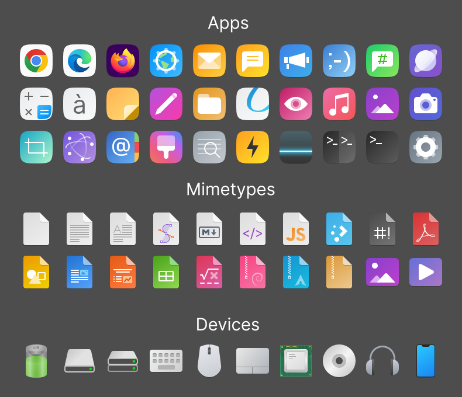
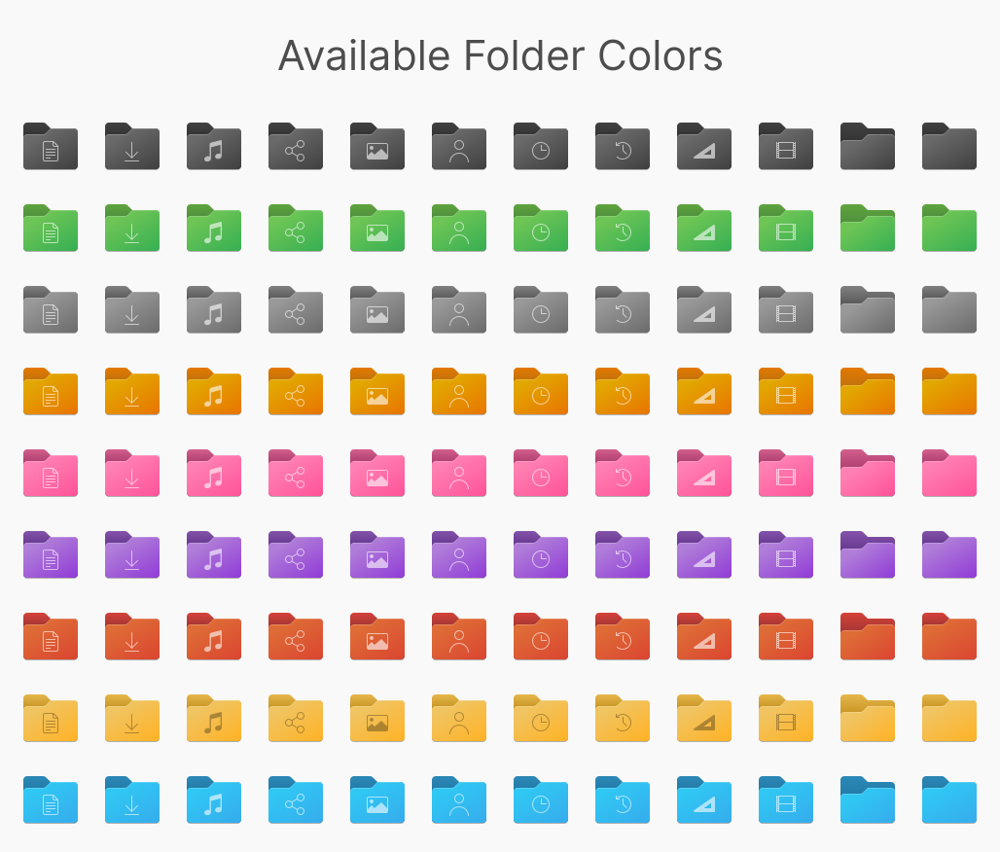
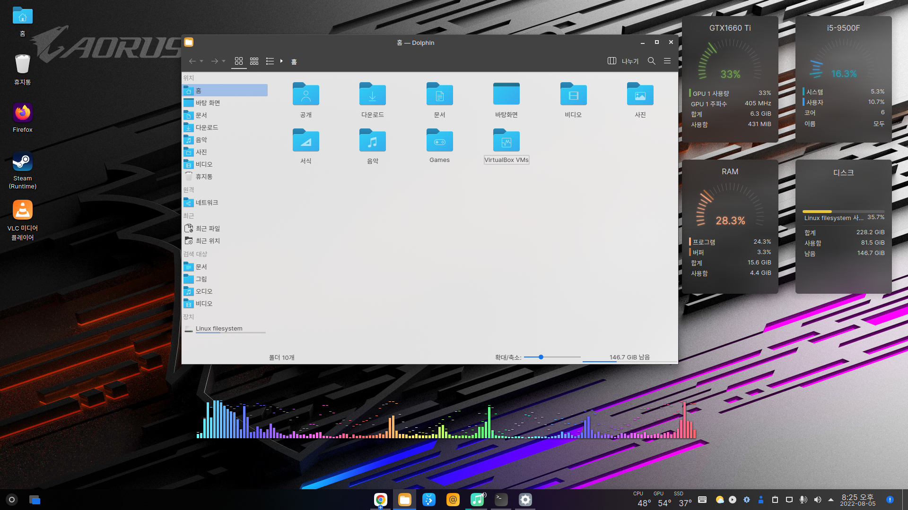
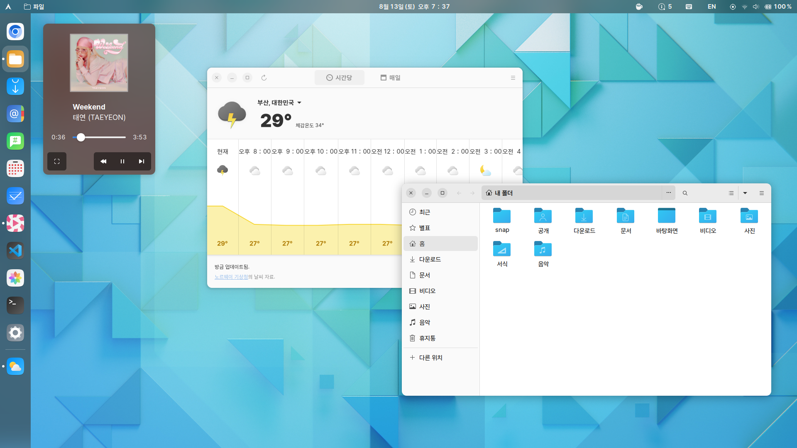
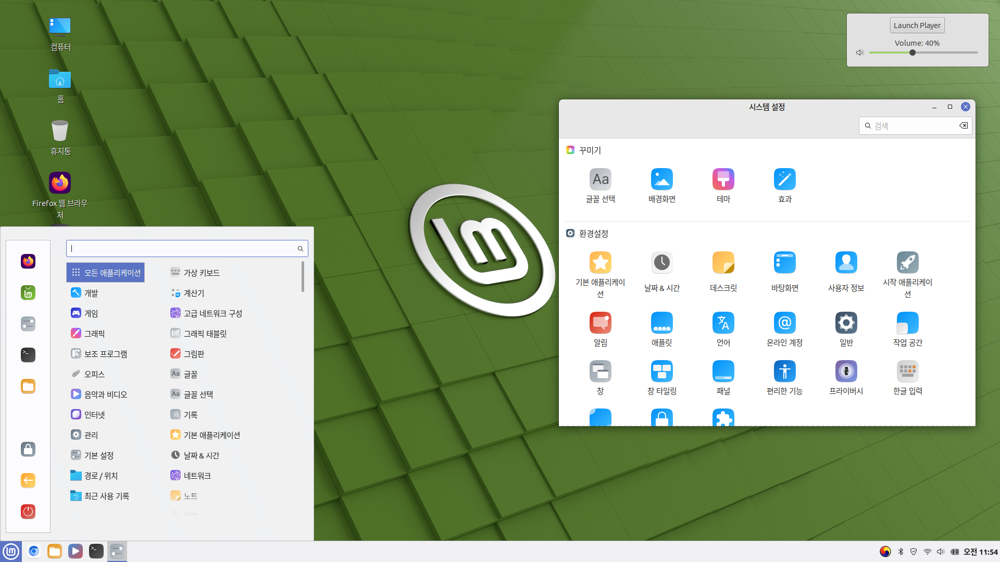

# Stylish-icon-theme
Modern icon theme for Linux Desktops

## Based On

* Fluent-icon-theme by vinceliuice

## To-Dos

- [ ] Folder Icons with KDE Color Scheme

- [ ] Packaging Icon Theme

## Preview

## Screenshots

*  KDE

*  GNOME

* Cinnamon

